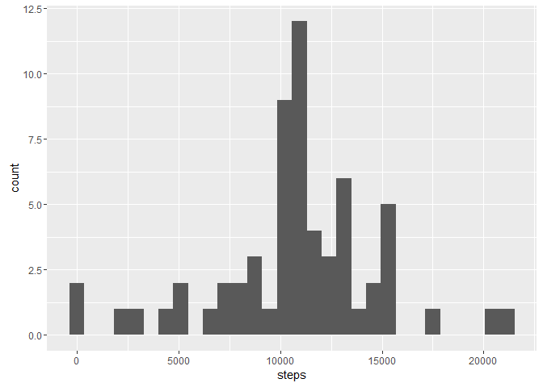
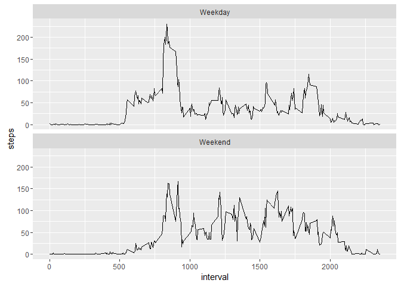

Hamilton Course Project 1 MarkDown Report
===========================


```r
library("plyr")
library("dplyr")
```

```
## 
## Attaching package: 'dplyr'
```

```
## The following objects are masked from 'package:plyr':
## 
##     arrange, count, desc, failwith, id, mutate, rename, summarise,
##     summarize
```

```
## The following objects are masked from 'package:stats':
## 
##     filter, lag
```

```
## The following objects are masked from 'package:base':
## 
##     intersect, setdiff, setequal, union
```

```r
library("ggplot2")

#Load Data
adata <- read.csv("activity.csv")

#Transform Data to get mean steps per data
daygroupeddata <- group_by(adata,date)

#Calculate total steps per day
totalstepsperday <- summarize(daygroupeddata, steps = sum(steps))
head(totalstepsperday)
```

```
## # A tibble: 6 x 2
##         date steps
##       <fctr> <int>
## 1 2012-10-01    NA
## 2 2012-10-02   126
## 3 2012-10-03 11352
## 4 2012-10-04 12116
## 5 2012-10-05 13294
## 6 2012-10-06 15420
```

```r
#Create Histogram of total steps taken each day of orginal data set
qplot(steps, data = totalstepsperday)
```

```
## `stat_bin()` using `bins = 30`. Pick better value with `binwidth`.
```

```
## Warning: Removed 8 rows containing non-finite values (stat_bin).
```

<!-- -->

```r
#Calculate mean of total steps per day
meanstepsperday <- mean(totalstepsperday$steps, na.rm = TRUE)
meanstepsperday
```

```
## [1] 10766.19
```

```r
#Calculate the median of total steps per day
medianstepsperday <- median(totalstepsperday$steps, na.rm = TRUE)
medianstepsperday
```

```
## [1] 10765
```

```r
#Transform Data to get interval and date matched up
intervalgroupeddata <- group_by(adata,interval)
head(intervalgroupeddata)
```

```
## Source: local data frame [6 x 3]
## Groups: interval [6]
## 
##   steps       date interval
##   <int>     <fctr>    <int>
## 1    NA 2012-10-01        0
## 2    NA 2012-10-01        5
## 3    NA 2012-10-01       10
## 4    NA 2012-10-01       15
## 5    NA 2012-10-01       20
## 6    NA 2012-10-01       25
```

```r
#Calculate average number steps per interval per day
totalstepsperinterval <- summarize(intervalgroupeddata, steps = mean(steps, na.rm = TRUE))
head(totalstepsperinterval)
```

```
## # A tibble: 6 x 2
##   interval     steps
##      <int>     <dbl>
## 1        0 1.7169811
## 2        5 0.3396226
## 3       10 0.1320755
## 4       15 0.1509434
## 5       20 0.0754717
## 6       25 2.0943396
```

```r
#Plot average number of steps per interval per day
ggplot(totalstepsperinterval, aes(x=interval,y=steps)) + geom_line()
```

<!-- -->

```r
#Identify the max average step interval---------------------
#Identify the largest step count
maxvalue <- max(totalstepsperinterval$steps)
#-----------------------------------------------------------


#Locate the interval with the largest step count
maxintervaldata <- totalstepsperinterval[which(totalstepsperinterval$steps == maxvalue),]
head(maxintervaldata)
```

```
## # A tibble: 1 x 2
##   interval    steps
##      <int>    <dbl>
## 1      835 206.1698
```

```r
#Total number of NAs in dataset
sum(is.na(adata$steps))
```

```
## [1] 2304
```

```r
#Create a new dataset with the NAs replaced with the mean of the interval-------------------------- 
# Create a copy of the original set
newadata = adata

#For each row, identify of it has a NA. If so, replace the value with the mean value for the interval
for(i in 1:nrow(adata))
{
  if (is.na(adata[i,1]) == TRUE )
  {
    intervalvalue = adata[i,3]
    
    locateinterval = totalstepsperinterval[which(totalstepsperinterval$interval == intervalvalue),]
    
    newadata[i,1] = locateinterval[1,2]
  }
}
#-----------------------------------------------------------------------------------------------------


#Transform New Data set to get mean steps per data
NewDataSet_daygroupeddata <- group_by(newadata,date)
head(NewDataSet_daygroupeddata)
```

```
## Source: local data frame [6 x 3]
## Groups: date [1]
## 
##       steps       date interval
##       <dbl>     <fctr>    <int>
## 1 1.7169811 2012-10-01        0
## 2 0.3396226 2012-10-01        5
## 3 0.1320755 2012-10-01       10
## 4 0.1509434 2012-10-01       15
## 5 0.0754717 2012-10-01       20
## 6 2.0943396 2012-10-01       25
```

```r
#Calculate total steps per day
NewDataSet_totalstepsperday <- summarize(NewDataSet_daygroupeddata, steps = sum(steps))
head(NewDataSet_totalstepsperday)
```

```
## # A tibble: 6 x 2
##         date    steps
##       <fctr>    <dbl>
## 1 2012-10-01 10766.19
## 2 2012-10-02   126.00
## 3 2012-10-03 11352.00
## 4 2012-10-04 12116.00
## 5 2012-10-05 13294.00
## 6 2012-10-06 15420.00
```

```r
#Create Histogram of total steps taken each day of new data set
qplot(steps, data = NewDataSet_totalstepsperday)
```

```
## `stat_bin()` using `bins = 30`. Pick better value with `binwidth`.
```

<!-- -->

```r
#Calculate mean of total steps per day of new data set
NewDataSet_meanstepsperday <- mean(NewDataSet_totalstepsperday$steps)
head(NewDataSet_meanstepsperday)
```

```
## [1] 10766.19
```

```r
#Calculate the median of total steps per day
NewDataSet_medianstepsperday <- median(NewDataSet_totalstepsperday$steps)
head(NewDataSet_medianstepsperday)
```

```
## [1] 10766.19
```

```r
#Converted the date column to a date object
newadata$date <- as.Date(newadata$date)

#For each row in the new data set, I created a new column called DayType
#that represents of the date is a weekday or a weekend
for(i in 1:nrow(newadata))
{
  if ((weekdays(newadata[i,2]) == "Saturday") || (weekdays(newadata[i,2]) == "Sunday"))
  {
    newadata$DayType[i] = "Weekend"
  }
  else
  {
    newadata$DayType[i] = "Weekday"
  }
}

#I converted the new DayType column to a factor variable
newadata$DayType <- as.factor(newadata$DayType)

#Transform Data to get interval and date matched up
weekend_intervalgroupeddata <- group_by(newadata,interval,DayType)
head(weekend_intervalgroupeddata)
```

```
## Source: local data frame [6 x 4]
## Groups: interval, DayType [6]
## 
##       steps       date interval DayType
##       <dbl>     <date>    <int>  <fctr>
## 1 1.7169811 2012-10-01        0 Weekday
## 2 0.3396226 2012-10-01        5 Weekday
## 3 0.1320755 2012-10-01       10 Weekday
## 4 0.1509434 2012-10-01       15 Weekday
## 5 0.0754717 2012-10-01       20 Weekday
## 6 2.0943396 2012-10-01       25 Weekday
```

```r
#Calculate average number steps per interval per day
weekend_totalstepsperinterval <- summarize(weekend_intervalgroupeddata, steps = mean(steps, na.rm = TRUE))
head(weekend_totalstepsperinterval)
```

```
## Source: local data frame [6 x 3]
## Groups: interval [3]
## 
##   interval DayType      steps
##      <int>  <fctr>      <dbl>
## 1        0 Weekday 2.25115304
## 2        0 Weekend 0.21462264
## 3        5 Weekday 0.44528302
## 4        5 Weekend 0.04245283
## 5       10 Weekday 0.17316562
## 6       10 Weekend 0.01650943
```

```r
#Plot average number of steps per interval per day in a panel plot
ggplot(weekend_totalstepsperinterval, aes(x=interval,y=steps)) + geom_line()+
  facet_wrap(~DayType, nrow = 2)
```

<!-- -->
